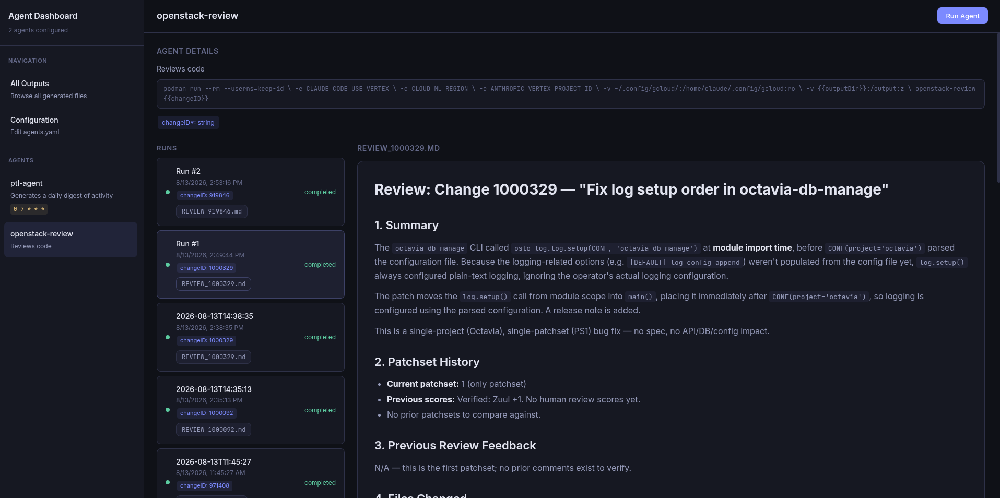

# Agent Dashboard

A lightweight web dashboard for spawning, monitoring, and browsing the outputs of AI agents. Everything is configured through a single YAML file — add agents, define parameters, and set commands with `{{template}}` placeholders.




## Quick Start

```bash
pip install pyyaml
python3 server.py
# Open http://localhost:8080
```

## How It Works

1. Define your agents in `agents.yaml`
2. Open the dashboard, select an agent, click **Run Agent**
3. Fill in the parameters — the command preview updates live
4. The agent runs in the background; its output lands in `outputs/<agent>/<run>/`
5. Browse and read the generated markdown files directly in the dashboard

Each run gets its own timestamped directory. The `{{outputDir}}` template variable is always available and points to it.

## Configuration

All agents are defined in `agents.yaml`:

```yaml
outputDir: ./outputs

agents:
  - name: summary-agent
    description: Generates a summary of a given topic
    command: "my-agent --topic {{topic}} --depth {{depth}} --out {{outputDir}}/summary.md"
    params:
      - name: topic
        label: Topic
        type: string
        required: true
        placeholder: "e.g. Kubernetes networking"
      - name: depth
        label: Analysis Depth
        type: select
        options: [shallow, medium, deep]
        default: medium

  - name: daily-digest
    description: Generates a daily digest
    command: "digest-agent --date {{date}} --out {{outputDir}}"
    schedule: "0 9 * * *"    # displayed in the UI as a badge
    params:
      - name: date
        label: Date
        type: string
        default: today
```

### Config Reference

| Field | Description |
|---|---|
| `outputDir` | Base directory for all agent outputs (default: `./outputs`) |
| `agents[].name` | Unique identifier for the agent |
| `agents[].description` | Short description shown in the sidebar |
| `agents[].command` | Shell command to run. Use `{{paramName}}` for parameter substitution and `{{outputDir}}` for the run's output directory |
| `agents[].schedule` | Optional cron expression — purely informational, displayed as a badge |
| `agents[].params` | List of parameter definitions |

### Parameter Types

| Type | Renders as |
|---|---|
| `string` | Text input |
| `select` | Dropdown (requires `options` list) |
| `textarea` | Multi-line text input |

Each parameter supports: `name`, `label`, `type`, `required`, `default`, `placeholder`, and `options` (for select).

## Template Variables

Commands use `{{variableName}}` placeholders that get replaced at run time:

- **`{{outputDir}}`** — always available, points to the run's unique output directory (`outputs/<agent>/run-<timestamp>/`)
- **`{{paramName}}`** — replaced with the value entered in the spawn dialog

Example:

```yaml
command: "python analyze.py --input {{file}} --format {{format}} > {{outputDir}}/report.md"
```

The `OUTPUT_DIR` environment variable is also set to the same path, so scripts can use either mechanism.

## Dashboard Views

- **Agent view** — agent details, active runs with status/stdout/stderr, and output history with markdown viewer
- **All Outputs** — browse every generated file across all agents, filterable by agent name
- **Configuration** — edit `agents.yaml` directly in the browser with YAML validation

## API

The server exposes a JSON API on the same port:

| Method | Endpoint | Description |
|---|---|---|
| `GET` | `/api/config` | Current configuration |
| `POST` | `/api/config` | Update config (JSON body) |
| `POST` | `/api/config/raw` | Update config (raw YAML text body) |
| `POST` | `/api/agents/:name/run` | Spawn an agent (JSON body with param values) |
| `GET` | `/api/runs` | List all runs with status |
| `GET` | `/api/runs/:id` | Single run details |
| `GET` | `/api/outputs` | List all output directories and their files |
| `GET` | `/api/outputs/:agent/:run/:file` | Read a specific output file |

## Project Structure

```
agent-dashboard/
├── server.py          # Python HTTP server (API + static file serving)
├── agents.yaml        # Agent definitions (edit this)
├── static/
│   └── index.html     # Single-file frontend (vanilla JS, no build step)
└── outputs/           # Generated output files
    └── <agent>/
        └── run-<timestamp>/
            └── *.md
```

## Environment Variables

| Variable | Default | Description |
|---|---|---|
| `PORT` | `8080` | Server port |
